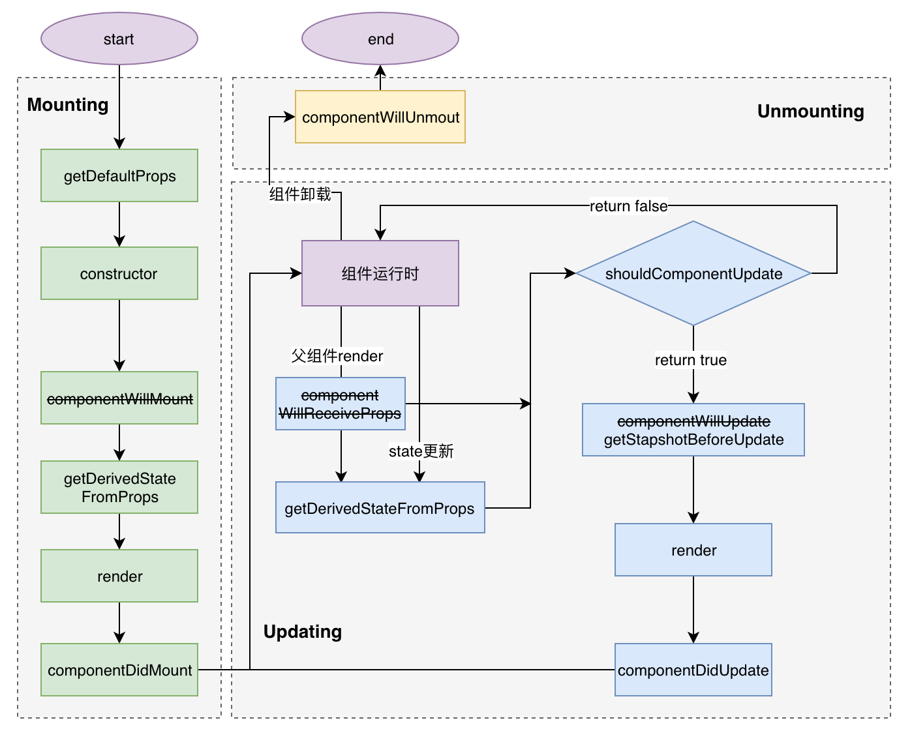
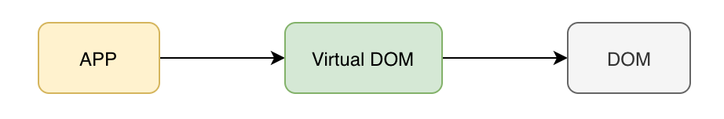
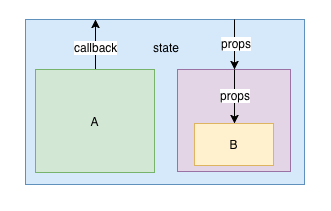
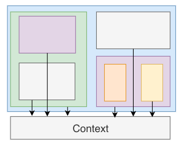

`React`只专注于`view`层（即MVC中的V）的表现，核心理念是`组件`, 可以将其理解成一个用于构建`前端可复用组件`的库，即通过一个独立封装的可复用`UI`部件(组件)的拼装组合来展现页面。

## JSX

DOM

```html
<div class="btn">
  <span>1</span>
  <span>2</span>
</div>
```

description

```json
{
  "type": "div",
  "props": {
    "className": "btn",
  },
  "children": [{
    "type": "span",
    "children": 1
  }, {
    "type": "span",
    "children": 2
  }]
}
```

JS

```js
React.createElement(
  'div',
  {className: 'btn'},
  React.createElement(
    'span',
    null,
    '1'
  ),
  React.createElement(
    'span',
    null,
    '2'
  ),
)
```

JSX

```jsx
<div className="btn">
  <span>1</span>
  <span>2</span>
</div>
```

* className

  > Since JSX is JavaScript, identifiers such as class and for are discouraged as XML attribute names. Instead, React DOM components expect DOM property names like className and htmlFor, respectively.

* 只允许被一个标签包裹

  > React.Fragment <></>

* 天然防XSS

## Component

```js
component = props => JSX
```
functional / stateless Component

```jsx
function Welcome(props) {
  return <h1>Hello, {props.name}</h1>;
}
```
class Component

* ES5:

```js
var Welcome = React.createClass({
  getDefaultProps: function() {
    return {
      name: 'Mary' //默认属性值
    };
  },
  
  getInitialState: function() {
    return {count: this.props.initialCount}; //初始化state
  },
  
  handleClick: function() {
    //用户点击事件的处理函数
  },

  render: function() {
    return <h1>Hello, {this.props.name}</h1>;
});
```

* ES6(推荐)：

```jsx
class Welcome extends React.Component {
  constructor(props) {
    super(props);
    this.state = {count: props.initialCount};
    this.handleClick = this.handleClick.bind(this);
  }

  render() {
    return <h1>Hello, {this.props.name}</h1>;
  }
}
```

> 为了区分用户自定义组件与DOM标签，要求组件名称必须以大写字母开头

## LifeCircle

> 对应版本： v16.4




## setState

```tsx
setState<K extends keyof S>(
   state: ((prevState: Readonly<S>, props: Readonly<P>) => (Pick<S, K> | S | null))
  				| (Pick<S, K> | S | null),
   callback?: () => void
): void;
```

* no `this.state = xxx`
* setState 并不是同步的

## Render

```jsx
import {render} from 'react-dom';
import App from './App';

render(App, document.getElementById('root'));
```



## PureComponent

* 具有浅比较的`shouldComponentUpdate`

* 避免使用可变对象作为props和state，培养好的编程习惯

## Controlled & Uncontrolled Component

```jsx
<input
    value={this.state.value}
    onChange={(e) => this.setState({value: e.target.value})}
>

<input 
    defaultValue={this.state.value}
    onChange={e => {this.setState({value: e.target.value})}}
>
```

## Higher-Order Components

```js
component = props => JSX

hoc = component => component
```

```jsx
import React, { Component } from 'react'

export default (WrappedComponent) => {
  class NewComponent extends Component {
    // 自定义逻辑
    render () {
      return <WrappedComponent />
    }
  }
  return NewComponent;
}
```

```jsx
import {connect} from 'react-redux';
...
export default connect(mapStateTopProps, mapDispatchToProps)(VerifyUserListView);
```

## Components Communication

### 父组件 -> 子组件(props)

  ```jsx
  class Parent extends Component{
    state = {
      money: 100;
    }
    render() {
      return <Child money={this.state.money}/>
    }
  }
  ```

### 子组件 -> 父组件(callback)

  ```jsx
  class Parent extends Component{
    state = {
      money: 100;
    }
    handleChangeMoney = money => this.setState({money});
    render() {
      return <Child onChangeMoney={this.handleChangeMoney}/>
    }
  }
  
  class Child extends Component{
    handleConsume = () => this.props.onChangeMoney(50);
    render() {
      return <button onClick={this.handleConsume}>消费</button>
    }
  }
  ```

### 跨级组件

  * Lifting State Up

    

  * 自定义事件

    ```jsx
    class Comp1 extends Component{
      Event.listen('eventName', this->handler);
    }
    
    class Comp2 extends Component{
      Event.trigger('eventName', payload);
    }
    ```

  * context

    context是一个全局变量,像是一个大容器,在任何地方都可以访问到,我们÷可以把要通信的信息放在context上,然后在其他组件中可以随意取到

    

  * 统一状态管理(redux)

## React Hooks

### version

* **proposal**@16.7.0-alpha

* **add**16.8.0 (February 6, 2019)

### motivation

* statelessComponent or PureComponent
* wrap hell

### example

```jsx
import {useState} from 'react';

function Example() {
  // Declare a new state variable, which we'll call "count"
  const [count, setCount] = useState(0);
  
  return (
    <div>
      <p>You clicked {count} times</p>
      <button onClick={() => setCount(count + 1)}>
        Click me
      </button>
    </div>
);
```


## Reference

> React官方文档  http://react.html.cn/docs/getting-started.html
>
> React基础设计思想 https://github.com/reactjs/react-basic
>
> 深入REACT技术栈 ,陈屹著 ,P351 ,2016.11.pdf 